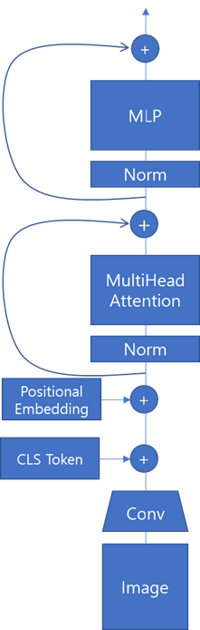
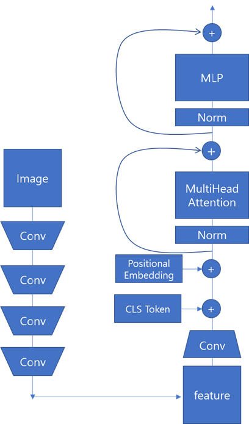
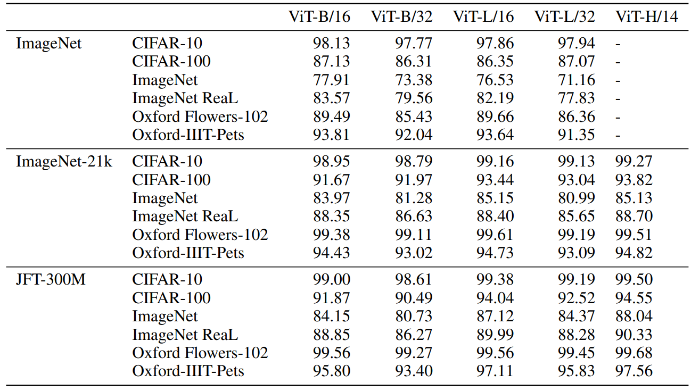

## ViT

ViT 모델은 Base, Large, Huge 모델이 있다. 그리고 PatchSize에 따라서 혹은 Resolution에 따라서 더 세부적으로 구분 할 수 있다. 

- 모델 크기가 커진다는 뜻은 사용되는 파라미터의 개수가 많아진다는 뜻이다. 모델의 크기가 커질 수록 더 많은 연산 시간을 가지게 된다.
- 패치 사이즈의 크기가 커진다는 뜻은 더 큰 조각으로 패치를 조각낸다는 뜻이다. 따라서 전체 패치의 개수는 감소하게 되고 사용되는 포지셔널 인코딩의 크기 또한 감소하게 된다. 패치 사이즈가 감소할 수록 더 많은 연산 시간을 가지게 된다. 
- 레졸루션이 커지면 이미지를 크게 리사이즈 한 뒤 모델에 집어 넣는 다는 뜻이다. 따라서 전체 패치의 개수가 늘어나게 되고 사용되는 포지셔널 인코딩의 크기 또한 증가되게 된다. 레졸루션이 커질 수록 더 많은 연산 시간을 가지게 된다.

| 모델 크기 (D_model, h, D_ff, N) | Patch Size | Resolution |
| ------------------------------- | ---------- | ---------- |
| Base (768, 12, 3072, 12)        | 16         | 224        |
| Large (1024, 16, 4096, 16)      | 32         | 384        |

ViT 모델의 구조는 Transformer Encoder 구조와 동일하다. 다만 이미지를 전처리하는 부분에 있어서만 조금 다를 뿐이다.

ViT + ResNet50 모델의 경우 기존에 이미지를 그대로 사용하던 것을 CNN을 이용해서 Feature Map으로 바꾼것에 해당한다.

### ViT Training Configuration

일단 가장 큰 차이는 LR과 Scheduler이다. 둘 다 시도해봐야겠다. 배치 사이즈는 어떻게 할 수가 없는 값이기 때문에 그냥 이대로 가는 수 밖에는 없다. 마지막이자 가장 중요한 Resolution이다. Resolution에 따라서 성능 차이가 많이 날 것 같다. 따라서 높은 Resolution으로 학습을 해봐야겠다.

|            | Original Paper                      | This Work   |
| ---------- | ----------------------------------- | ----------- |
| Scheduler  | Warmup + Cosine Learning Rate Decay | MultiStepLR |
| Optimizer  | SGD                                 | SGD         |
| Epoch      | 100 (10k step * 512 batch size)     | 50          |
| LR         | 3e-2                                | 3e-4        |
| Batch Size | 512                                 | 32          |
| Resolution | 384                                 | 224, 384    |

Expected Result

공식 깃헙 레포에 올라와있는 결과 (이게 목표)

| model        | dataset      | dropout=0.0                                                  | dropout=0.1                                                  |
| ------------ | ------------ | ------------------------------------------------------------ | ------------------------------------------------------------ |
| R50+ViT-B_16 | cifar10      | 98.72%, 3.9h (A100), [tb.dev](https://tensorboard.dev/experiment/nwXQNjudRJW3dtQzhPZwwA/#scalars&regexInput=^R50.ViT-B_16/cifar10/do_0.0&_smoothingWeight=0) | 98.94%, 10.1h (V100), [tb.dev](https://tensorboard.dev/experiment/nwXQNjudRJW3dtQzhPZwwA/#scalars&regexInput=^R50.ViT-B_16/cifar10/do_0.1&_smoothingWeight=0) |
| R50+ViT-B_16 | cifar100     | 90.88%, 4.1h (A100), [tb.dev](https://tensorboard.dev/experiment/nwXQNjudRJW3dtQzhPZwwA/#scalars&regexInput=^R50.ViT-B_16/cifar100/do_0.0&_smoothingWeight=0) | 92.30%, 10.1h (V100), [tb.dev](https://tensorboard.dev/experiment/nwXQNjudRJW3dtQzhPZwwA/#scalars&regexInput=^R50.ViT-B_16/cifar100/do_0.1&_smoothingWeight=0) |
| R50+ViT-B_16 | imagenet2012 | 83.72%, 9.9h (A100), [tb.dev](https://tensorboard.dev/experiment/nwXQNjudRJW3dtQzhPZwwA/#scalars&regexInput=^R50.ViT-B_16/imagenet2012/do_0.0&_smoothingWeight=0) | 85.08%, 24.2h (V100), [tb.dev](https://tensorboard.dev/experiment/nwXQNjudRJW3dtQzhPZwwA/#scalars&regexInput=^R50.ViT-B_16/imagenet2012/do_0.1&_smoothingWeight=0) |
| ViT-B_16     | cifar10      | 99.02%, 2.2h (A100), [tb.dev](https://tensorboard.dev/experiment/nwXQNjudRJW3dtQzhPZwwA/#scalars&regexInput=^ViT-B_16/cifar10/do_0.0&_smoothingWeight=0) | 98.76%, 7.8h (V100), [tb.dev](https://tensorboard.dev/experiment/nwXQNjudRJW3dtQzhPZwwA/#scalars&regexInput=^ViT-B_16/cifar10/do_0.1&_smoothingWeight=0) |
| ViT-B_16     | cifar100     | 92.06%, 2.2h (A100), [tb.dev](https://tensorboard.dev/experiment/nwXQNjudRJW3dtQzhPZwwA/#scalars&regexInput=^ViT-B_16/cifar100/do_0.0&_smoothingWeight=0) | 91.92%, 7.8h (V100), [tb.dev](https://tensorboard.dev/experiment/nwXQNjudRJW3dtQzhPZwwA/#scalars&regexInput=^ViT-B_16/cifar100/do_0.1&_smoothingWeight=0) |
| ViT-B_16     | imagenet2012 | 84.53%, 6.5h (A100), [tb.dev](https://tensorboard.dev/experiment/nwXQNjudRJW3dtQzhPZwwA/#scalars&regexInput=^ViT-B_16/imagenet2012/do_0.0&_smoothingWeight=0) | 84.12%, 19.3h (V100), [tb.dev](https://tensorboard.dev/experiment/nwXQNjudRJW3dtQzhPZwwA/#scalars&regexInput=^ViT-B_16/imagenet2012/do_0.1&_smoothingWeight=0) |
| ViT-B_32     | cifar10      | 98.88%, 0.8h (A100), [tb.dev](https://tensorboard.dev/experiment/nwXQNjudRJW3dtQzhPZwwA/#scalars&regexInput=^ViT-B_32/cifar10/do_0.0&_smoothingWeight=0) | 98.75%, 1.8h (V100), [tb.dev](https://tensorboard.dev/experiment/nwXQNjudRJW3dtQzhPZwwA/#scalars&regexInput=^ViT-B_32/cifar10/do_0.1&_smoothingWeight=0) |
| ViT-B_32     | cifar100     | 92.31%, 0.8h (A100), [tb.dev](https://tensorboard.dev/experiment/nwXQNjudRJW3dtQzhPZwwA/#scalars&regexInput=^ViT-B_32/cifar100/do_0.0&_smoothingWeight=0) | 92.05%, 1.8h (V100), [tb.dev](https://tensorboard.dev/experiment/nwXQNjudRJW3dtQzhPZwwA/#scalars&regexInput=^ViT-B_32/cifar100/do_0.1&_smoothingWeight=0) |
| ViT-B_32     | imagenet2012 | 81.66%, 3.3h (A100), [tb.dev](https://tensorboard.dev/experiment/nwXQNjudRJW3dtQzhPZwwA/#scalars&regexInput=^ViT-B_32/imagenet2012/do_0.0&_smoothingWeight=0) | 81.31%, 4.9h (V100), [tb.dev](https://tensorboard.dev/experiment/nwXQNjudRJW3dtQzhPZwwA/#scalars&regexInput=^ViT-B_32/imagenet2012/do_0.1&_smoothingWeight=0) |
| ViT-L_16     | cifar10      | 99.13%, 6.9h (A100), [tb.dev](https://tensorboard.dev/experiment/nwXQNjudRJW3dtQzhPZwwA/#scalars&regexInput=^ViT-L_16/cifar10/do_0.0&_smoothingWeight=0) | 99.14%, 24.7h (V100), [tb.dev](https://tensorboard.dev/experiment/nwXQNjudRJW3dtQzhPZwwA/#scalars&regexInput=^ViT-L_16/cifar10/do_0.1&_smoothingWeight=0) |
| ViT-L_16     | cifar100     | 92.91%, 7.1h (A100), [tb.dev](https://tensorboard.dev/experiment/nwXQNjudRJW3dtQzhPZwwA/#scalars&regexInput=^ViT-L_16/cifar100/do_0.0&_smoothingWeight=0) | 93.22%, 24.4h (V100), [tb.dev](https://tensorboard.dev/experiment/nwXQNjudRJW3dtQzhPZwwA/#scalars&regexInput=^ViT-L_16/cifar100/do_0.1&_smoothingWeight=0) |
| ViT-L_16     | imagenet2012 | 84.47%, 16.8h (A100), [tb.dev](https://tensorboard.dev/experiment/nwXQNjudRJW3dtQzhPZwwA/#scalars&regexInput=^ViT-L_16/imagenet2012/do_0.0&_smoothingWeight=0) | 85.05%, 59.7h (V100), [tb.dev](https://tensorboard.dev/experiment/nwXQNjudRJW3dtQzhPZwwA/#scalars&regexInput=^ViT-L_16/imagenet2012/do_0.1&_smoothingWeight=0) |
| ViT-L_32     | cifar10      | 99.06%, 1.9h (A100), [tb.dev](https://tensorboard.dev/experiment/nwXQNjudRJW3dtQzhPZwwA/#scalars&regexInput=^ViT-L_32/cifar10/do_0.0&_smoothingWeight=0) | 99.09%, 6.1h (V100), [tb.dev](https://tensorboard.dev/experiment/nwXQNjudRJW3dtQzhPZwwA/#scalars&regexInput=^ViT-L_32/cifar10/do_0.1&_smoothingWeight=0) |
| ViT-L_32     | cifar100     | 93.29%, 1.9h (A100), [tb.dev](https://tensorboard.dev/experiment/nwXQNjudRJW3dtQzhPZwwA/#scalars&regexInput=^ViT-L_32/cifar100/do_0.0&_smoothingWeight=0) | 93.34%, 6.2h (V100), [tb.dev](https://tensorboard.dev/experiment/nwXQNjudRJW3dtQzhPZwwA/#scalars&regexInput=^ViT-L_32/cifar100/do_0.1&_smoothingWeight=0) |
| ViT-L_32     | imagenet2012 | 81.89%, 7.5h (A100), [tb.dev](https://tensorboard.dev/experiment/nwXQNjudRJW3dtQzhPZwwA/#scalars&regexInput=^ViT-L_32/imagenet2012/do_0.0&_smoothingWeight=0) | 81.13%, 15.0h (V100), [tb.dev](https://tensorboard.dev/experiment/nwXQNjudRJW3dtQzhPZwwA/#scalars&regexInput=^ViT-L_32/imagenet2012/do_0.1&_smoothingWeight=0) |

논문에서 말하는 결과

