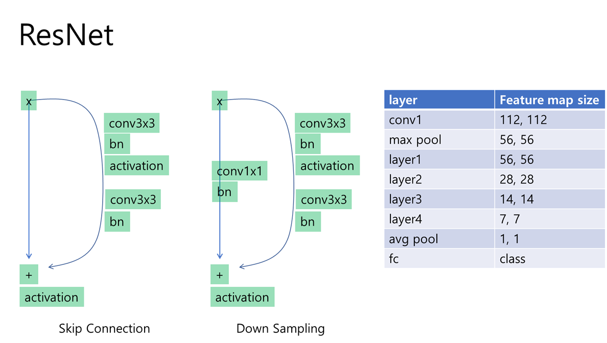

## ResNet

ResNet Summary 

### ResNet50 Train Log  

*last modified: 2021-09-14 04:10:01.965184+09:00 Time zone is seoul,korea (UTC+9:00)*

resnet50 (83.7)

|  no  | model_name | dataset  |        time         |     top1_acc      |     top5_acc      |  valid_best_acc   | valid_best_epoch | nepoch |   lr   | dropout | total_batch_size | world_size | max_gpu_usage |
| :--: | :--------: | :------: | :-----------------: | :---------------: | :---------------: | :---------------: | :--------------: | :----: | :----: | :-----: | :--------------: | :--------: | :-----------: |
|  7   |  resnet50  | cifar100 | 2021-09-13/13-53-38 | 83.76402282714844 | 97.86658477783203 | 83.91426086425781 |        31        |   50   | 0.0003 |   0.0   |        32        |     1      |    4330.0     |
|  11  |  resnet50  | cifar100 | 2021-09-13/17-54-50 | 83.68389892578125 | 97.73638153076172 | 83.29327392578125 |        42        |   50   | 0.0003 |   0.0   |        32        |     1      |    4333.0     |
|  13  |  resnet50  | cifar100 | 2021-09-13/21-23-25 | 83.7540054321289  | 97.80648803710938 | 83.27323913574219 |        32        |   50   | 0.0003 |   0.0   |        32        |     1      |    4333.0     |

resnet50 (96.1)

|  no  | model_name | dataset |        time         |     top1_acc      |     top5_acc      |  valid_best_acc  | valid_best_epoch | nepoch |   lr   | dropout | total_batch_size | world_size | max_gpu_usage |
| :--: | :--------: | :-----: | :-----------------: | :---------------: | :---------------: | :--------------: | :--------------: | :----: | :----: | :-----: | :--------------: | :--------: | :-----------: |
|  8   |  resnet50  | cifar10 | 2021-09-13/13-53-38 | 96.07372283935547 | 99.93990325927734 | 96.8349380493164 |        34        |   50   | 0.0003 |   0.0   |        32        |     1      |    4327.0     |
|  12  |  resnet50  | cifar10 | 2021-09-13/18-01-00 | 96.06370544433594 | 99.96995544433594 | 96.9150619506836 |        47        |   50   | 0.0003 |   0.0   |        32        |     1      |    4331.0     |
|  15  |  resnet50  | cifar10 | 2021-09-13/21-53-00 | 96.08373260498047 | 99.93990325927734 | 97.0352554321289 |        34        |   50   | 0.0003 |   0.0   |        32        |     1      |    4331.0     |

### ResNet 101 Train Log  

*last modified: 2021-09-14 04:10:01.966027+09:00 Time zone is seoul,korea (UTC+9:00)*

resnet101 (97.2)

|  no  | model_name | dataset |        time         |     top1_acc      |     top5_acc      |  valid_best_acc   | valid_best_epoch | nepoch |   lr   | dropout | total_batch_size | world_size | max_gpu_usage |
| :--: | :--------: | :-----: | :-----------------: | :---------------: | :---------------: | :---------------: | :--------------: | :----: | :----: | :-----: | :--------------: | :--------: | :-----------: |
|  10  | resnet101  | cifar10 | 2021-09-13/13-54-09 | 97.01522827148438 | 99.94992065429688 | 97.43589782714844 |        33        |   50   | 0.0003 |   0.0   |        32        |     1      |    6537.0     |
|  16  | resnet101  | cifar10 | 2021-09-13/20-26-06 | 97.35577392578125 | 99.9599380493164  | 97.73638153076172 |        28        |   50   | 0.0003 |   0.0   |        32        |     1      |    6537.0     |
|  18  | resnet101  | cifar10 | 2021-09-14/01-28-31 | 97.15544891357422 | 99.96995544433594 | 97.57612609863281 |        30        |   50   | 0.0003 |   0.0   |        32        |     1      |    6537.0     |

resnet101 (85.6)

|  no  | model_name | dataset  |        time         |     top1_acc      |     top5_acc      |  valid_best_acc   | valid_best_epoch | nepoch |   lr   | dropout | total_batch_size | world_size | max_gpu_usage |
| :--: | :--------: | :------: | :-----------------: | :---------------: | :---------------: | :---------------: | :--------------: | :----: | :----: | :-----: | :--------------: | :--------: | :-----------: |
|  9   | resnet101  | cifar100 | 2021-09-13/13-54-10 | 85.55689239501953 | 98.26722717285156 | 85.61698913574219 |        29        |   50   | 0.0003 |   0.0   |        32        |     1      |    6540.0     |
|  14  | resnet101  | cifar100 | 2021-09-13/20-01-59 | 85.74720001220703 | 98.06690979003906 | 85.87740325927734 |        31        |   50   | 0.0003 |   0.0   |        32        |     1      |    6540.0     |
|  17  | resnet101  | cifar100 | 2021-09-14/00-58-46 | 85.56690979003906 | 98.29727935791016 | 85.71714782714844 |        37        |   50   | 0.0003 |   0.0   |        32        |     1      |    6540.0     |

